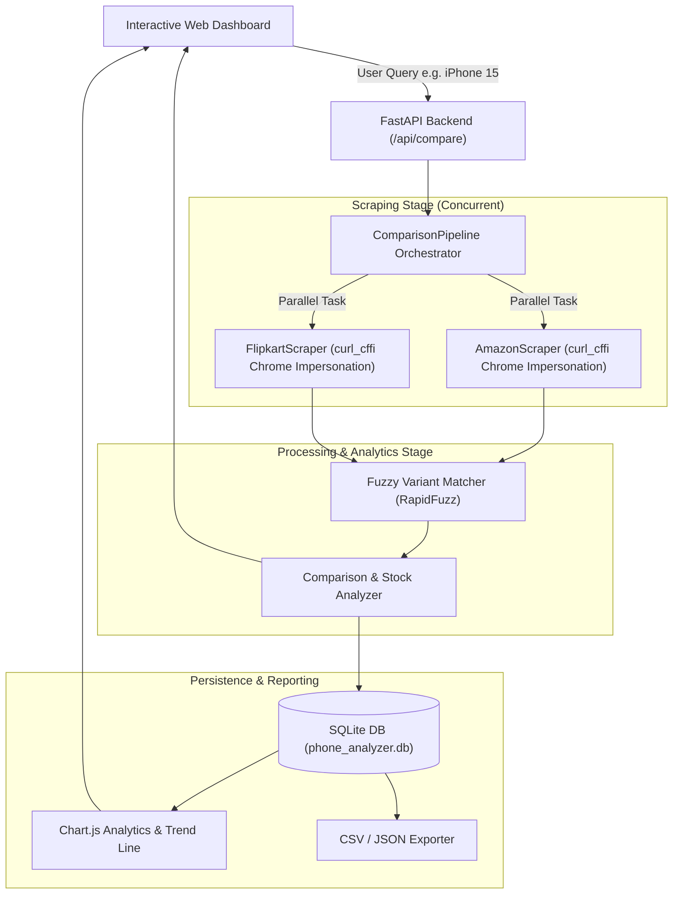

# Amazon vs Flipkart Smartphone Price Comparison Analyzer

A full-stack, automated web scraping and data analytics platform built with **Python 3.14**, **FastAPI**, **curl_cffi**, **SQLite**, **Tailwind CSS**, and **Chart.js**.

The application tracks smartphone pricing across **Amazon India** and **Flipkart**, handles live and out-of-stock inventory discrepancies, computes savings, aligns models using fuzzy matching, stores historical price snapshots, and renders an interactive data dashboard with live pipeline telemetry.

---

## Key Features

1. **Multi-Platform Price Delta & Savings Engine**:
   - Compares selling prices, MRP, and discount percentages between Amazon India and Flipkart.
   - Highlights the winning store with exact savings in ₹ and percentage.
   - Direct purchase links for both platforms.

2. **Smart Availability & Stock Verification**:
   - Detects whether a phone is **In Stock**, **Out of Stock**, or **Currently Unavailable**.
   - Handles real-world edge cases:
     - **Both In Stock**: Determines lowest price and best savings.
     - **One Platform Out of Stock**: Flags the available retailer as the sole purchase option.
     - **Both Out of Stock**: Warns user with clear out-of-stock status badges.
     - **Platform Exclusivity**: Identifies phones listed only on one platform.

3. **Intelligent Variant & Fuzzy Matching**:
   - Utilizes `rapidfuzz` token-set ratio analysis combined with storage (128GB, 256GB, 512GB) and RAM extraction.
   - Prevents mismatched variant comparisons (e.g. comparing 128GB with 256GB).

4. **Multi-Stage Telemetry Pipeline**:
   - Visualized in the web dashboard:
     1. **Stage 1**: Query Ingestion & Storage/RAM Normalization
     2. **Stage 2**: Concurrent Scraping (Amazon & Flipkart in parallel via `ThreadPoolExecutor`)
     3. **Stage 3**: Fuzzy Variant Alignment
     4. **Stage 4**: Stock & Price Discrepancy Analytics
     5. **Stage 5**: SQLite Persistence & Timeline Logging

5. **Interactive Analytics Dashboard**:
   - **Price Comparison Bar Chart**: Side-by-side selling price vs list price (MRP).
   - **Historical Price Trend Line Chart**: Tracks price drops and fluctuations over time.
   - **Platform Win Rate Donut Chart**: Breakdown of which platform offers better deals.
   - **KPI Metrics**: Total comparisons tracked, average savings, peak discount, and stock availability rate.

6. **Data Export & Portability**:
   - Export full comparison records to **CSV** or **JSON** with a single click.

---

## System Architecture & Pipeline



---

## Installation & Setup

### 1. Clone the repository
```bash
git clone https://github.com/bhavyasoni707/Python-Project.git
cd Python-Project
```

### 2. Install dependencies
```bash
pip install -r requirements.txt
```

### 3. Run the application
```bash
python run.py
```
Open your browser and navigate to:
```
http://127.0.0.1:8000
```

---

## Running Automated Tests

Run the complete test suite:
```bash
python -m pytest -v
```

Tests cover:
- **Variant Fuzzy Matching**: Storage parsing, RAM parsing, title normalization, similarity scoring.
- **Stock & Deal Analyzer**: Flipkart cheaper, Amazon cheaper, single platform in stock, both out of stock.
- **SQLite Database**: Table creation, foreign key relations, price history logging, analytics summary.
- **Scrapers & Fallback Catalog**: Parsing resilience, stock indicators.
- **FastAPI Endpoints**: Web UI serving, comparison endpoint, analytics overview, and CSV export.

---

## Project Structure

```
Python-Project/
├── app/
│   ├── config.py             # Global constants, paths, and smartphone presets
│   ├── main.py               # FastAPI application & REST endpoints
│   ├── database/
│   │   ├── db.py             # SQLite connection, CRUD, analytics queries
│   │   └── models.py         # Schema & dataclass models
│   ├── pipeline/
│   │   ├── analyzer.py       # Price delta & stock availability logic
│   │   ├── matcher.py        # Fuzzy variant matcher
│   │   └── pipeline.py       # Master pipeline with live telemetry
│   ├── scrapers/
│   │   ├── amazon.py         # Amazon India scraper (curl_cffi)
│   │   ├── base.py           # Base scraper interface & StockStatus enum
│   │   ├── fallback_seed.py  # Resilient smartphone seed catalog
│   │   └── flipkart.py       # Flipkart scraper (curl_cffi)
│   ├── static/
│   │   ├── css/styles.css    # Custom styles, animations, badges
│   │   └── js/
│   │       ├── api.js        # Backend API fetch client
│   │       ├── app.js        # Main UI controller & pipeline animator
│   │       └── charts.js     # Chart.js renderers (Bar, Line, Doughnut)
│   └── templates/
│       └── index.html        # Interactive dashboard & pipeline UI
├── data/
│   └── phone_analyzer.db     # SQLite database
├── tests/
│   ├── test_analyzer.py      # Analyzer & stock scenario unit tests
│   ├── test_api.py           # FastAPI endpoints unit tests
│   ├── test_db.py            # Database CRUD unit tests
│   ├── test_matcher.py       # Variant matching unit tests
│   └── test_scrapers.py      # Scraper extraction unit tests
├── requirements.txt          # Python dependencies
├── run.py                    # Root single-click launcher
└── README.md                 # Project documentation
```
